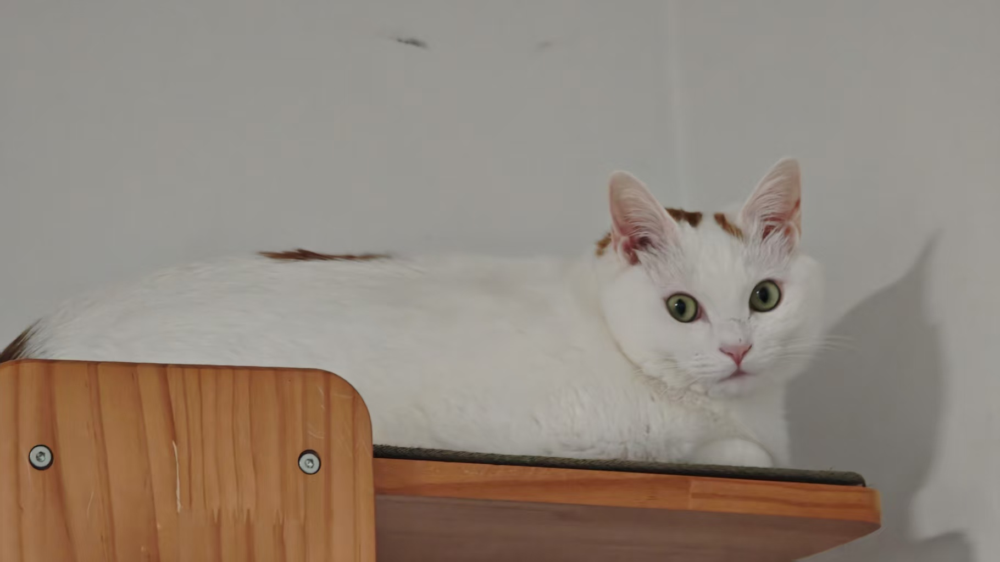

# 半包辅材

1. 水泥: PC425 海螺牌优选，m325备选
1. U-PVC：符合`GB/T5836.1`，全屋排水管选伟星、日丰。
1. PPR给水管：符合`GB/T18742`，全部用热水管；日丰瓷芯抗菌管或伟星瓷芯抗菌管二选一（热水用橙色，冷水用蓝色）。
1. 界面剂：符合`JCT2329-2015`或者`JGT468`标准。望固/马贝G（工地不得出现801、901、108等等违规胶水，袋子也不允许）。
1. 嵌缝石膏：符合`JC/T2075`执行标准的，美巢`QN600QF`
1. 腻子：符合`JG/T298-2010`，环保符合`GB18582-2020`，找平石膏美巢`QN700KL`（冲筋和刮平都用700KL就行）。700kl是轻质石膏，价格和600kl相似的情况下，性能要更好一些。面层腻子/美巢`ygp800GQ`（`ygp800JJ`也可以）。
1. 墙面瓷砖胶：马贝C2TE/必能达/柏特建材，符合执行标准`JC/T547-2017`。
1. 地面拉毛乳液：马贝SP700/望固全能；拉毛乳液、水泥、砂砾配比：1-1-1.25。
1. 轻钢：符合`GB/T11981-2008`执行标准，圣戈班黄金龙骨。厚度：主龙 1.0，卡式主龙 0.8；副龙 0.5
1. 石膏板：符合执行标准`GB/T9775-2008`，泰山金砖石膏板（干区）和泰山金砖蓝鲸板（湿区）
1. 白乳胶：环保符合`GB18583`；百得熊猫。
1. 填缝剂：符合`JC/T1004-2017`；马贝环氧彩砂141或者聚脲彩砂。
1. 线管：伟星305中型管。
1. 漏电保护：正泰NB2LE（不能用空开代替）。
1. 电线：执行标准：`GB/T5023.3-2008`；本地符合国标的。千岛湖永通BV（或阻燃BV）。
1. 防水：墙面：马贝通用型，`JC/T984`标准；地面：马贝柔效型，`GB/T23445-2009` Ⅱ型。
1. 网线：秋叶原6类普通非屏蔽网线。
1. 包管：杰爱板。
1. 抗碱玻纤网：克里斯汀。
1. 配件：阴阳角条金属，金属骑马卡2CM间距。

# 施工要求

## 新建挂网

1. 确定墙顶面基层质量：基层铲除，铲到基层铲不动为止，如果掉粉特别严重需要铲到红砖层，然后重新抹灰。抹灰前砖需要润湿。卫生间、阳光房、阳台的旧防水层铲除干净，重新做防水层。
1. 卫生间有新砌隔墙必须做地梁/地梁高度15-20CM,地梁不放钢筋
1. 新旧墙体之间植筋一定要清理干净孔道，新旧墙体交界地方，把旧墙体粉层打掉10公分宽度，挂网的时候贴在这个缝上，垒墙每隔50公分加设两根钢筋植筋
1. 打植筋胶：植筋胶打满，用3级钢植筋，10MM钢筋，砌墙前一天做植筋施工。顶部斜砌。抹灰前砖需要润湿。
1. 红砖 加气 轻质砖 要根据不同的情况采用不同的选择，优先选择红砖
1. 湿区新砌墙体底部要安装防水带设置，尽量采用网格布做基本防裂处理局部挂抗碱玻纤网。
1. 主卧与书房之间的阳台隔断用实心轻质砖做隔断。
1. 新门头用镀锌角铁与墙体连接大于10cm

## 电路施工

1. 严格按照`GB50054`和`GB51348`用电规范执行
1. 一定要先弹线，再开槽。同线槽走2根以上防火管需要留足空间！
1. 16平以下的所有横切面必须保持一致，导体需要相同材料，不可以零线火线4平 配2.5平的地线
1. 点对点弧弯工艺，先排管，后穿线必须保证全屋活线
1. 地面排线用金属骑马卡2cm间距
1. 86盒一定要带锁母6.如果开横槽不超过50cm
1. 如果粱上打孔，不打连排空，建议打一个孔间隔10公分再打一个孔
1. 同线槽走2根以上防火管需要留足空间，线管之间距2cm，花洒出水口间距15CM。
1. 优先使用大的双排强电箱
1. 等电位一定要接，紫铜端子压线
1. 厨房布线建议使用八爪鱼布线法
1. 水电不要同槽，20管里电线不能超过40%，建议4平3根，2.5平4根
1. 顶面灯具移位套黄蜡管。电线接头并线处 挂锡或者wago或者紫铜管冷压（三选一）
1. 厨房 卫生间分线需要用4平，厨房空调单独回路（4平）
1. 强弱电管的并行间距要求是150mm 以上，如果可以尽量达到300mm或以上
1. 强弱电要分开交叉处屏蔽处理(金属套管或锡纸)
1. 一定要安装漏保：总闸一定是空开，分闸的人能够触碰到的电器和低于2.4m的灯具回路用漏保
1. 水电整体一口价，不按米收费
1. 不以增加开关插座线路为理由中途加钱。
1. 安装插座、灯具等需要一起计算在内，不单独收费
1. 电工离场前对电箱回路进行标记
1. 拍摄全屋隐蔽工程管线留底：墙面管道尽量标注实际距离，确保后期安装打孔避开、水电问题检验等

## 水路施工

1. 水管吊卡间距60公分一个，三通和直角处15公分以内一个，先弹线再开槽
1. 给水总开关建议用球阀，PPR整管裁掉前段3CM
1. 走顶热水管需要保温棉，走天水路不要使用过桥弯
1. 冷热水管不应同槽，如有同槽时应间距30mm以上
1. 花洒出水口间距15CM
1. 马桶和洗菜池下水不用存水弯用直角弯找坡
1. 卫生间所有横向排水不出现直角，必须用斜通
1. 马桶在排水的最末端，立管有条件的可以加伸缩节
1. 线槽用GBT25181标准预拌砂浆加马贝sp700乳液粉平填实，普通水泥砂浆填缝有可能会开裂
1. 水管走顶，走顶部分保温棉包裹；横向排水用斜通；水电相遇电在上；线槽用GBT25181标准预拌砂浆粉平
1. 遇到内丝用生料带。遇到外丝用麻丝缠绕涂刷铅油（白厚漆）

## 界面剂

1. 符合`JC/T2329-2015`或者`JC/T468`执行标准，不限制品牌（推荐马贝G）
1. 不出现黄墙绿地，不使用801 901胶水兑色浆
1. 必须使用2329渗透型界面剂
1. 找平前 防水前 腻子前，都需要刷一遍来锁水。防水层上就不用刷了！
1. 界面剂环节一定不能刷黄墙绿地，一定不能用胶水兑色浆！
1. 马贝G界面剂用在这些地方：
   1. 刷防水之前
   1. 新建墙抹灰之前
   1. 刮腻子之前
   1. 无防水墙面贴砖之前
   1. 石膏板缝隙+回填线槽之前

## 防水

1. 地面涂刷：马贝柔效型，执行标准：`GB/T23445-2009` Ⅱ型。
1. 墙面涂刷：马贝通用型，执行标准：`JC/T984`。淋浴区涂满墙，其他地方高于出水口即可
1. 阴角、管根用堵漏王做小R角，门洞两侧以及内外要涂刷到位，干区墙面防水高于出水口即可。
1. 先墙后地；返墙30cm、淋浴区水管墙刷1.8m；下沉式做2遍防水；48h蓄水测试；地面防水门洞向外延申20cm做止水坎
1. 涂刷防水前必须打扫干净，涂刷2329或者468标准界面剂后再刷防水！

## 包管

1. 厨房卫生间阳台阳光房：水管先包隔声棉，再用2cm厚的水泥预制板包管，再包一层防水背衬板

## 贴砖

1. 地面：拉毛：可以选择瓷砖背面涂刷拉毛乳液/水泥/砂砾配比1/1/1.25，然后用水泥砂浆厚贴。马贝SP700（拉毛前瓷砖一定要用湿抹布擦干净！）(拉毛调配好，用大勺子舀到瓷砖背面用拉毛滚筒涂刷，不能用滚筒沾着去拉毛)
1. 墙面：薄贴：冲筋找平后薄贴，瓷砖胶完成厚度不超过8MM，建议5MM左右。
1. 墙砖单片空鼓率＜15%，整体空鼓率＜5%；墙砖、地砖对缝；瓷砖开孔采用开孔器；瓷砖间隙采用十字卡；卫生间地砖做坡度；回子型地漏，地漏、马桶排污管处用堵漏王封填
1. 出现荷珠效应的砖，必须先清理把瓷砖背面的脱模剂、蜡、油清理干净后才能贴砖！
   1. 解决方法：在瓷砖背面通抹1:5的水泥油，静置1-2分钟后，再用刷子冲刷干净

## 美缝

1. 全屋，留缝2.5mm/(有地暖的必须3MM，瓷砖边长大于80公分的也必须3MM。
1. 40\*40CM之类的小规格瓷砖且没有地暖才可以做2-2.5mm的伸缩缝)
1. 贴砖完成后一周左右用`jct1004-2017`的填缝材料填缝，不限制品牌
1. 卫生间不出现真瓷胶、聚脲等非标产品
1. 厨房和卫生间：马贝环氧彩砂141；除厨房和卫生以外的其他地方：聚脲

## 踢脚线、门框

1. 不开横槽做隐藏踢脚线：腻子在踢脚线的位置找平误差2MM安装踢脚线后不打胶，后建议做实木明装之类的踢脚线！门框同理
1. 首先要确保腻子环节踢脚线的平整度，然后打楔子无痕钉安装踢脚线，就不需要打胶。门框同理。

## 腻子乳胶漆

1. 腻子符合`JG/T298-2010`执行标准，不得添加胶水！环保等级`gb18582-2020`
1. 平整度门框和踢脚线等地方做到2MM以内，其他地方肉眼距离100CM处观察，平整 没有波浪纹
1. 乳胶漆 `gbt9756-2018` 优等品，环保等级`gb18582-2020` 乳胶漆：多乐士 劲瓷洁/立邦五合一；底漆：多乐士 抗碱底漆/立邦抗碱底漆。
1. 滚涂，一底二面，多次涂刷，每次薄一点5.乳胶漆兑水10%左右，施工中不得添加801、901等胶水，使用纯净水勾兑，差不多5L的乳胶漆一瓶纯净水
1. 防水前、批刮腻子前滚刷1遍界面剂；1遍底层腻子，1遍面层腻子；1遍底漆，2遍面漆；顺平、局部垂平（门套、柜体边缝处）工艺施工；开槽处采用嵌缝石膏封堵并封纸带；局部挂网：新旧墙交界处、开槽处、墙体开缝出；全屋挂阴阳角条

## 吊顶

1. 轻钢龙骨用圣戈班黄金龙骨。石膏板用圣戈班石膏板，符合`GB/T9775-2008`标准。
1. 弹线打螺丝，顶面主龙骨50公分一个膨胀螺丝，吊点间距不超120cm。转角处、链接处用龙骨钳固定，边吊转角处，需要有吊筋给往上的拉力。铆钉固定的话建议双铆钉固定
1. 墙面边龙骨60公分一个膨胀螺丝（或者米固钉）不可以用枪钉打，拐角的地方主龙骨延伸到最里面。(龙骨和墙体固定的地方必须是有膨胀钉固定，不可以用枪钉固定！)
1. 边龙骨超过30公分加主龙骨，主龙骨和龙骨之间的距离控制在80cm，副龙间距40cm左右，不得出现石膏板下挂，墙面固定必须用膨胀螺丝！钉面做防锈处理腻子抹平。
1. 固定板材要从中间向四周固定，板材周边钉距建议15cm，双层石膏板上下层接缝要错开，不得在同一根龙骨上，固定板材是次龙骨间距不得超过60cm。
1. 转角处整板施工；石膏板错峰拼接，拼接处做V字缝；钉孔处刷防锈漆；预留检修口（根据实际需要施工）

## 阴阳角条

1. 全屋铝合金收口条（代替PVC），加抗裂砂浆覆盖，水平仪垂直。错误做法是做在腻子里面！

## 墙面找平

1. 方案一（优先）：马贝151、马贝界面剂G、马贝水泥增强剂；
1. 方案二：美巢QN600GQ高强粉刷石膏冲筋、美巢QN700KL抗裂轻质粉刷石膏找平、美巢QN600QF嵌缝石膏补缝、喜美网格带、纤网（大网格带）加厚角条、水平激光仪、工具、人工，灯光找平；

## 其他

1. 全屋插座、开关预留智能家电零线。
1. 预留前置过滤器、软水器、净水器管路接口、插座。
1. 隐藏在柜子里的插座要另外接控制开关到柜子外。
1. 热水器要预留零冷水、回水管路。
1. 冰箱、风管机、空调、浴霸等大功率家电要独立回路，视频监控系统预留独立供电线路。
1. 必须预留水电燃气管道的检修口。
1. 阳台要留给水管（洗手池、洗衣机）和供电回路（扫地机器人、洗衣机）

## 新建红砖墙要求：

1. 老墙打孔；
1. 吹孔洞灰尘；
1. 带勾的钢筋摸植筋胶；
1. 带植筋胶的钢筋插入孔洞
1. 每隔600mm左右高度设置拉结筋；
1. 门洞上方用预支过梁，或4mm厚热镀锌角钢过梁；
1. 过梁伸入两边墙体各150mm左右；
1. 新建红砖墙挂钢丝网，新旧墙体交接处也需要挂网（老墙剔除200mm宽一起挂网）；
1. 挂完网后墙体喷水湿润厚再用水泥砂浆抹灰；

> 注意：
>
> 1. 砌墙需打红外线，保证平整度、垂直度；
> 1. 红砖需要泡水湿润后用水泥砂浆砌筑；
> 1. 如果采用加气砖砌筑墙体需要在底层砌筑3-5层红砖（有地暖5层，无地暖3层），再用加气砖砌筑上方墙体，最好使用瓷砖胶（雨虹C90或德高一型都可以，成本很低）砌筑（因加气砖吸水率特别大，水泥砂浆会导致粘接强度低），然后挂玻纤网，再用瓷砖胶抹灰，完全不影响后续做乳胶漆、防水或贴砖；
> 1. 新建墙体顶面需用红砖斜砌，防止墙体沉降后与顶面产生裂缝；
> 1. 长度小于0.6m的小面积墙体可以不植筋；
> 1. 有地暖的门洞高度一般为2200，无地暖门洞高度一般为2100；
